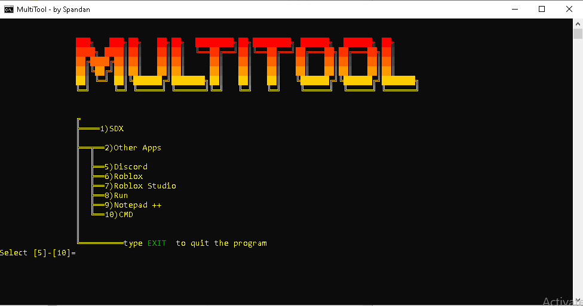

 __    __     __  __     __         ______   __     ______   ______     ______     __        
/\ "-./  \   /\ \/\ \   /\ \       /\__  _\ /\ \   /\__  _\ /\  __ \   /\  __ \   /\ \       
\ \ \-./\ \  \ \ \_\ \  \ \ \____  \/_/\ \/ \ \ \  \/_/\ \/ \ \ \/\ \  \ \ \/\ \  \ \ \____  
 \ \_\ \ \_\  \ \_____\  \ \_____\    \ \_\  \ \_\    \ \_\  \ \_____\  \ \_____\  \ \_____\ 
  \/_/  \/_/   \/_____/   \/_____/     \/_/   \/_/     \/_/   \/_____/   \/_____/   \/_____/ 
                                                                                             
                                                                        			

What is multitool:- 
Multitool is a tool, that will help you in simple tasks like opening an app, starting your minecraft server, etc...

Motivtion:-
The primary motivation behind this project was to solve the desktop mess. Instead of navigating through multiple folders or searching the Start menu, I wanted a main file that can launch my most-used applications and manage my local Minecraft server instance with a single interaction.

Inspiration:-
This project was inspired by the batch file interfaces and the efficiency of batch scripting. I wanted to create a lightweight hub that utilizes Windows command line without the need for heavy, third-party launchers.

Setup Gude:- 
1. Download all the files.
2. Make Multitool\Files
3. Make Multitool\Files\App
4. Make shortcuts of Discord, Notepad++, CMD, Roblox, Roblox Studio, and Run and name them Discord, Notepad++, CMD, RobloxPlayer, RobloxStudio, and Run respectively in Multitool\Files\App
5. Make Multitool\Files\Minecraft Server
6. Open Multitool\Files\Minecraft Server
7. Copy and Paste your server files in this folder.
8. You are ready!!

How does it work:-
Follow all the instructions, and respond.

Tech Stack:-
Language: This is made in Batch Language, the original language by Windows.
Operating System: This can only work in Windows and batch is only supported on Windows. You can run it on others Operating Systems, but you will need a third party compiler for batch.

Images:-

